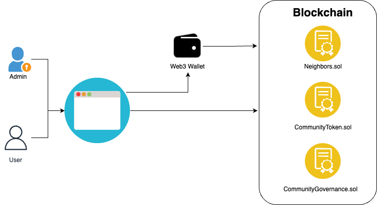

# Gated community - Overview

## Introduction

This application proposes to treat the expenses of a closed neighborhood in a transparent way and leaving a surplus for works that improve the quality of life of the residents.
These works will be proposed and voted for by the neighbors through smart contracts and residents will have to be up to date and pay their expenses to have the power to vote and create proposals.

You can see a detailed explanation of the use-cases [here](use-cases.md).

## Technical overview

This is a web3 based application where the smart-contracts stores the neighbors data along with the proposals and their voting power. The nieghbors and the system administration will access this information through a dApp developed in Remix + Reactjs with the integration of Metamask or any Injected web3 wallet.

### Components

In the following diagram, you can see a quick overview of the components of this application:

- The smart-contract lives in a blockchain (we're using a local blockchain)
- Web3wallet: either MetaMask or any Injected wallet.
- System administrator: The owner of the `Neighbors.sol` contract (`signer0` in local deployment).
- User: any account registered as a Neighbor in the `Nieghbors.sol` contract.

#### Smart contracts:

- `CommunityGovernance.sol`: Governance-like pattern contract that uses CTK token for countabilizing voting and proposal creation power. This contract is in charge of executing proposals in case it succeeded.

- `CommunityToken.sol`: ERC20 token that supports voting and creating governance proposals (CTK).

- `Nieghbors.sol`: Stores neighbors and their debts. Accept payments and is in charge of minitng CTK tokens depending on the neighbor's lot area.
